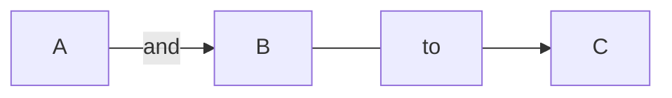

# SQLSPOG
Azure Arc SQL Single Pane of Glass

Kusto Queries for Azure ARC SQL Servers and Databases you can add to a dashboard

Download instruction for how to build this dashboard in "install and setup Azure Arc enabled SQL Server.pdf


> [!NOTE]
> Useful information that users should know, even when skimming content.

> [!TIP]
> Helpful advice for doing things better or more easily.

> [!IMPORTANT]
> Key information users need to know to achieve their goal.

> [!WARNING]
> Urgent info that needs immediate user attention to avoid problems.

> [!CAUTION]
> Advises about risks or negative outcomes of certain actions.
<details>
  <summary>Click to here. </summary>
   
   ### You can add a message here

   You can add text within a collapsed section. 

   You can add an image or a code block, too.

   ```ruby
     puts "Hello World"
   ```
  
</details>

